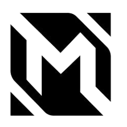

<p align="center"></p>
<h1 align="center">Mobile Legends — Hand Controller 🖐️🎮</h1>

คุม **Mobile Legends** (บน **MuMu Player**) ด้วย **2 มือผ่านเว็บแคม** แทนคีย์บอร์ด/จอย

- **มือซ้าย** = virtual joystick เดิน — เลื่อนมือรอบ "วงกลาง" → กด **W/A/S/D** ตามทิศ (กดค้างต่อเนื่อง)
- **มือขวา** = เลื่อนฝ่ามือเข้า **"วงปุ่ม"** แล้ว **จีบนิ้ว/กำหมัด** = ยิงปุ่มนั้น (สกิล/โจมตี/รีคอล/อัพสกิล)

> ออกแบบให้ **เล่นได้จริง พอเอาตัวรอดในแมตช์** ไม่ใช่แค่โชว์ — เน้นลื่น + แม่น ปรับจูนหน้ากล้องได้ง่าย

---

## ⬇️ ดาวน์โหลด (พร้อมใช้ — ไม่ต้องลง Python)

โหลดไฟล์ `.exe` ล่าสุดที่ 👉 **[Releases](https://github.com/pondlnwtrue007/MLBB-Hand-Controller/releases/latest)**
แตก zip แล้ว **คลิกขวา `ML Hand Controller.exe` → Run as administrator** (จำเป็น ไม่งั้นปุ่มไม่เข้า MuMu)

> อยากรันจากซอร์ส/แก้โค้ดเอง → ดูข้อ 1 ด้านล่าง

---

## 1. ติดตั้ง (รันจากซอร์ส)

ต้องมี **Python 3.10–3.12** (แนะนำ 3.12) — mediapipe ยังไม่รองรับ 3.13

```bash
cd "W:\Mobile Legends — Hand Controller"
pip install -r requirements.txt
```

ครั้งแรกที่รัน โปรแกรมจะ **ดาวน์โหลดโมเดลมือ** `hand_landmarker.task` (~7.5MB) ให้อัตโนมัติ
(เก็บไว้ที่ `%LOCALAPPDATA%\MLHandController`)

---

## 2. ตั้ง Keymapping ใน MuMu (ทำครั้งเดียว — สำคัญมาก)

โปรแกรมนี้แค่ "กดปุ่มคีย์บอร์ด" ให้ — ต้องให้ MuMu รู้ว่าปุ่มไหนคืออะไรในเกม
เปิด **MuMu → ปุ่มแมปคีย์ (keyboard mapping editor)** แล้วตั้งดังนี้:

| ในเกม | ปุ่มที่ต้องแมป | หมายเหตุ |
|-------|----------------|----------|
| จอยเดิน (ทิศทาง) | **W / A / S / D** | ใช้ "ปุ่มทิศทาง/joystick" ของ MuMu วางทับปุ่มเดินในเกม |
| โจมตีปกติ | **H** | |
| สกิล 1 / 2 / 3 | **Q / E / R** | |
| Spell (เช่น flicker) | **F** | |
| Recall (กลับฐาน) | **B** | |
| Regen (ฮีล) | **G** | |
| อัพสกิล 1 / 2 / 3 | **1 / 2 / 3** | |

จากนั้นในเกม **เปิด Quick Cast** สำหรับสกิล (ตั้งค่า → ควบคุม → ร่ายอัตโนมัติ/Quick Cast)
เพราะระบบเราเป็นแบบ "แตะ = ร่ายเลย" ไม่มีการลากเล็งทิศ

> ถ้าซื้อของตั้ง auto ไว้แล้ว ก็ไม่ต้องแมปปุ่มซื้อของ

---

## 3. รัน

### วิธีง่ายสุด (แนะนำ)
ดับเบิลคลิก **`เล่น Mobile Legends.bat`** — มันจะ **ขอสิทธิ์ Administrator ให้เอง**
(จำเป็น! ไม่งั้น Windows จะบล็อกไม่ให้ปุ่มเข้า MuMu)

### รันจาก command line
```bash
python main.py --test     # โหมดซ้อม: โชว์ทุกอย่างบนกล้อง แต่ยังไม่ยิงปุ่มจริง (ปลอดภัย)
python main.py            # โหมดเล่นจริง (ต้องรัน terminal เป็น Administrator)
```
Flags: `--camera 1` (เปลี่ยนกล้อง), `--config myconfig.json`

---

## 4. Calibrate + วิธีเล่น

1. เปิดโปรแกรม (`--test` ก่อน) → หน้าต่าง preview เด้งขึ้น
2. **ยกมือซ้าย**ไว้ตรงตำแหน่งที่ถนัด (จะเป็นจุดกลาง joystick) แล้วกด **`C`** → นับถอยหลัง → ตั้งจุดกลาง
3. **เดิน:** เลื่อนมือซ้ายออกจากจุดกลาง — เกิน "วง" = เดินทิศนั้น, กลับเข้าวง = หยุด
4. **สกิล:** เลื่อน**มือขวา** (จุดกลางฝ่ามือ = cursor สีฟ้า) เข้าไปในวงปุ่ม → วงจะไฮไลต์ →
   **กำหมัด** = ยิงปุ่มนั้น (cursor เปลี่ยนเป็นสีแดง). ต้อง**แบมือ**ก่อน ถึงจะยิงใหม่ได้
   - วง **attack (H)** ตั้ง `repeat` ไว้ = กำหมัดค้างในวง = รัวโจมตีอัตโนมัติ
5. พอใน `--test` ทุกอย่างเข้าที่ กด **`T`** เพื่อออกจาก test → มีเวลานับถอยหลังให้สลับไปหน้าต่าง MuMu → เริ่มยิงจริง

### ปุ่มลัดในหน้าต่าง preview
| ปุ่ม | ทำอะไร |
|------|--------|
| `C` | ตั้งจุดกลาง joystick (วางมือซ้ายตรงกลางแล้วกด) |
| `E` | **โหมดจัดวางปุ่มเอง** (ลากวงด้วยเมาส์) — ดูข้อ 4.1 |
| `P` | สลับ preview **ลอยหน้าสุด** (ดูมือได้ระหว่างเล่น MuMu) — เปิดไว้ default |
| `T` | สลับ test mode (ยิงจริง ↔ โชว์เฉย ๆ) |
| `R` | reload `config.json` สด ๆ (แก้ค่าแล้วเห็นผลทันที ไม่ต้องปิด) |
| `Q` / `Esc` | ออก |

### 4.1 จัดวางปุ่มเองด้วยเมาส์ (กด `E`)
อยากได้วงปุ่มอยู่ตรงไหน ลากเอาได้เลย ไม่ต้องแก้ตัวเลขใน config:
1. กด **`E`** เข้าโหมดจัดวาง (แถบเหลืองขึ้นบนสุด, ระหว่างนี้หยุดยิงปุ่ม)
2. **ลากวง** (คลิกซ้ายค้างแล้วลาก) = ย้ายตำแหน่ง
3. **ล้อเมาส์** หรือปุ่ม **`[`** / **`]`** = ย่อ/ขยายวงที่เลือก
4. กด **`S`** = เซฟลง `config.json` (ขึ้น SAVED สีเขียว)
5. กด **`E`** อีกที = ออกจากโหมดจัดวาง

> เคล็ดลับ: จัดให้วงที่ใช้บ่อย (H โจมตี, Q/E/R สกิล) อยู่ในระยะที่มือขวาเอื้อมถึงสบายหน้ากล้อง
> ส่วนวงที่นาน ๆ ใช้ (B recall, 1/2/3 อัพสกิล) วางมุมบนได้

---

## 5. ปรับจูน (`config.json`)

แก้ไฟล์แล้วกด **`R`** ในโปรแกรมเพื่อ reload ทันที

**การเดิน (`move`)**
- `deadzone` / `deadzone_out` — ขนาด "วงตาย" ตรงกลาง (สัดส่วนความกว้างจอ). เกิน `deadzone` = เริ่มเดิน,
  ต่ำกว่า `deadzone_out` = หยุด (ค่าต่างกันเล็กน้อย = กันเดิน ๆ หยุด ๆ กระพริบ). ถ้าเดินไวไป → เพิ่ม `deadzone`
- `origin` — จุดกลาง joystick (กด `C` ตั้งจากมือจริงง่ายกว่า)
- `directions` — `4` (ตรงเท่านั้น) หรือ `8` (มีเฉียง เช่น W+A). *เปลี่ยนเป็น 8 ได้ทันทีถ้าอยากลอง*

**ท่ายิง (`gesture.fire_gesture`)** — เลือกได้ 3 แบบ (แนะนำ **pinch**):
| ค่า | ท่า | เหมาะกับ |
|-----|-----|----------|
| `"pinch"` ⭐ | **จีบนิ้ว** (นิ้วโป้งแตะนิ้วชี้) | เร็ว ไม่เมื่อย สแปมสกิล/โจมตีถี่ ๆ — แนะนำสำหรับเล่นจริง |
| `"fist"` | **กำหมัด** (งอ 4 นิ้ว) | กันกดผิดสุด ๆ แต่ล้ามือถ้ายิงเยอะ |
| `"trigger"` | **เหนี่ยวไก** (งอนิ้วชี้ กางนิ้วกลางค้าง) | ฟีลเหมือนลั่นไกปืน |

ทุกแบบทำงานเหมือนกัน: เลื่อนฝ่ามือเข้าวง → ทำท่า = ยิง, ต้องคลายท่าก่อนถึงยิงใหม่ (กันรัวไม่ตั้งใจ)
- `pinch_on` / `pinch_off` — [pinch] จีบติดเมื่อระยะโป้ง-ชี้ < `pinch_on`, คลายเมื่อ > `pinch_off` (ปรับถ้าจีบไว/ยากไป)
- `fist_max_open` / `open_min` — [fist] กำหมัดนับเมื่อเหยียด ≤ กี่นิ้ว / แบเมื่อเหยียด ≥ กี่นิ้ว

> ดู meter มุมขวาล่าง (`FIRE: READY/FIRE`) ตอน `--test` เพื่อจูนให้ทำท่าติดพอดี

**วงปุ่ม (`zones`)** — แต่ละวง: `{name, key, cx, cy, r, repeat}`
- `cx,cy,r` = ตำแหน่ง/รัศมี (สัดส่วน 0–1 ของจอ). ขยับวงให้ตรงกับที่มือขวาเอื้อมถึงสบาย
- `repeat:true` = กำหมัดค้าง = รัว (เหมาะกับโจมตีปกติ). `key` = ปุ่มที่จะกด (ต้องตรงกับที่แมปใน MuMu)
- เพิ่ม/ลบวงได้ตามใจ — ระบบใช้ "กำหมัด" ท่าเดียวกับทุกวง

**อื่น ๆ**
- `smoothing` — ความนุ่มของการติดตามมือ (มาก = ไว/สั่นง่าย, น้อย = นิ่ง/หน่วง)
- `swap_hands` — ถ้าจับสลับข้าง (มือเดินไปโผล่เป็นมือสกิล) ตั้ง `true`
- `detect_width` — ย่อภาพก่อนตรวจ (เล็ก = เร็วขึ้นแต่แม่นน้อยลง)
- `always_on_top` — preview ลอยหน้าสุด (default `true`); กด `P` สลับได้ตอนรัน. ลอยแบบไม่แย่ง focus จาก MuMu
  ลากมุมหน้าต่างย่อให้เล็กแล้ววางมุมจอ = เห็นมือระหว่างเล่น + เอาไปมุมคลิปได้

---

## 6. แก้ปัญหา

**ปุ่มไม่เข้า MuMu (ฮีโร่ไม่ขยับ/สกิลไม่ลั่น)** — ไล่ทีละข้อ:
1. รัน **`python test_key.py`** แล้วรีบคลิกหน้าต่าง MuMu — ถ้าอันนี้ก็ไม่เข้า แปลว่าปัญหาอยู่ที่ input ไม่ใช่กล้อง
2. **ต้องรันเป็น Administrator** (ใช้ `.bat` หรือคลิกขวา Run as administrator) — MuMu รันสิทธิ์สูง ถ้าเราต่ำกว่า Windows บล็อกเงียบ ๆ
3. **แมป keymapping ใน MuMu แล้วหรือยัง** (ข้อ 2) — ปุ่มในเกมต้องตรงกับ `key` ใน config
4. **หน้าต่าง MuMu ต้อง focus** — มุมขวาบนต้องขึ้นสีเขียวตอน MuMu อยู่หน้าสุด.
   หน้าต่างเกม MuMu มักมีชื่อว่า **"Android Device"** (ไม่ใช่ "MuMu") — ค่า default ตั้งเป็นอันนี้ให้แล้ว.
   ถ้าของคุณชื่ออื่น รัน **`python check_window.py`** แล้วคลิก MuMu เพื่อดูชื่อจริง แล้วเอาไปใส่ `target_window`
   ใน config (ตั้ง `""` = ยิงตลอดไม่เช็ค focus)
5. บางเวอร์ชัน MuMu มีโหมด input หลายแบบ — ลองสลับใน MuMu settings ถ้ายังไม่เข้า

**กล้องไม่ขึ้น / FPS ต่ำ**
- เปลี่ยน `camera.index` (0,1,2...) หรือใช้ `--camera 1`; ปิด OBS/Zoom/เบราว์เซอร์ที่แย่งกล้อง
- FPS ต่ำ → ลด `detect_width` (เช่น 384) หรือใช้ไฟให้สว่างขึ้น

**จับมือสลับซ้าย-ขวา** → ตั้ง `swap_hands: true` หรือเปลี่ยน `hand_assignment` เป็น `"handedness"`

**เดินเพี้ยน/ทิศไม่ตรง** → กด `C` ตั้งจุดกลางใหม่ให้ตรงตำแหน่งมือที่ยกจริง

---

## 7. โครงไฟล์

| ไฟล์ | หน้าที่ |
|------|---------|
| `main.py` | ลูปหลัก + ปุ่มลัด |
| `camera.py` | กล้อง threaded (latency ต่ำ) |
| `hands.py` | MediaPipe HandLandmarker (2 มือ) + สกัดฟีเจอร์ (กลางฝ่ามือ, กำหมัด, handedness) |
| `controller.py` | logic: joystick มือซ้าย + วง/กำหมัด มือขวา |
| `input_sender.py` | ยิง scancode เข้าเกม (SendInput) + ตรวจ focus |
| `overlay.py` | วาด joystick/วง/cursor/HUD บนกล้อง |
| `config.py` + `config.json` | ตั้งค่าทั้งหมด (reload ด้วย `R`) |
| `test_key.py` | ทดสอบยิงปุ่มเข้า MuMu แยกเดี่ยว |
| `เล่น Mobile Legends.bat` | รันแบบ auto-admin |
